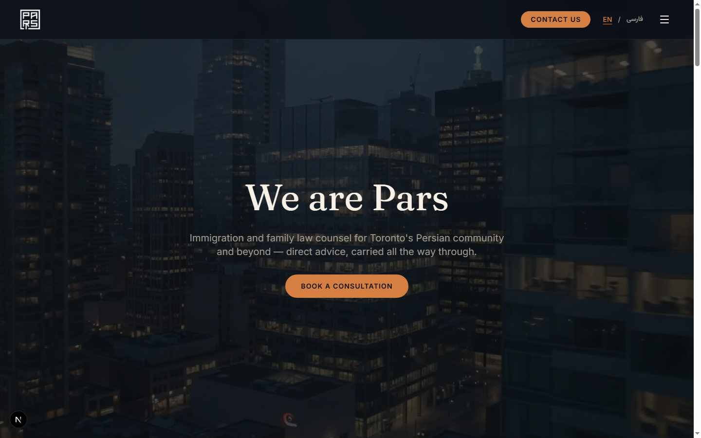
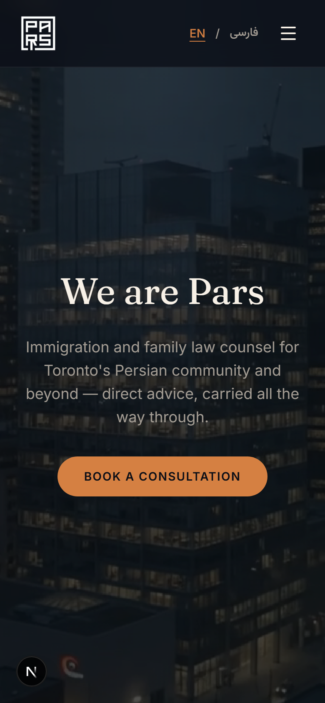

# Pars — Immigration & Family Law

A bilingual (English / فارسی) marketing site for **Pars**, a fictional Toronto
immigration and family law practice. Built as a design/portfolio exercise —
every color, font, photo, and word of copy on the site is original; only the
overall layout rhythm was inspired by a reference law-firm site during
development.

## Preview

<table>
  <tr>
    <td width="65%"><strong>Desktop</strong><br/></td>
    <td><strong>Mobile</strong><br/></td>
  </tr>
</table>

The homepage runs through nine sections: a video hero, an insights/articles
grid, a practice-areas split panel, anonymized case results, a full team
grid with photography, a careers panel, a "life at Pars" video moment, an
about panel, and a footer with office contact details. Every section is
fully bilingual — the language toggle in the header switches all copy
between English and Farsi, including right-to-left text flow for Farsi
content.

## Tech Stack

- **Next.js 16** — App Router, React 19, TypeScript strict
- **Tailwind CSS v4** — oklch design tokens, custom typography utilities
- **shadcn/ui** (`base-nova` style) — Radix/`@base-ui` primitives
- **next/font** — self-hosted Inter, Fraunces, Vazirmatn, and Noto Naskh
  Arabic for bilingual typography

## Features

- **Bilingual EN/FA content** — all UI strings and structured content
  (articles, case results, team bios) are stored as `{ en, fa }` pairs and
  rendered through a shared `t()` lookup, with block-level RTL flipping for
  Farsi text.
- **Original photography and video** — team headshots, section imagery, and
  the hero/culture background videos were all generated for this project in
  a consistent dark-navy/warm-amber house style.
- **Custom logo system** — a single supplied logo is derived into a
  transparent header mark, a full footer lockup, and platform favicons
  (`favicon.ico`, `icon.png`, `apple-icon.png`).

## Getting Started

```bash
npm install
npm run dev
```

Then open [http://localhost:3000](http://localhost:3000).

```bash
npm run build      # Production build
npm run lint        # ESLint check
npm run typecheck   # TypeScript check
npm run check        # lint + typecheck + build
```

## Project Structure

```
src/
  app/              # Next.js routes, layout, favicon/icon assets
  components/
    sections/       # Header, Hero, Insights, Practice Areas, Case Results,
                     # Team, Careers, Culture, About, Footer
    ui/             # shadcn/ui primitives
  lib/
    content.ts      # Structured bilingual content (nav, articles, team, office)
    dictionary.ts    # Bilingual UI strings
    language-context.tsx # Locale state + RTL handling
public/
  images/           # Logo, section photography, team headshots
  videos/           # Hero and culture-section background video
docs/
  design-references/ # Screenshots and visual references
  research/          # Original design-token/layout research
```

## Credits

Scaffolded from the [AI Website Cloner Template](https://github.com/JCodesMore/ai-website-cloner-template)
(MIT licensed) and built out from there with [Claude Code](https://docs.anthropic.com/en/docs/claude-code).

## License

MIT
